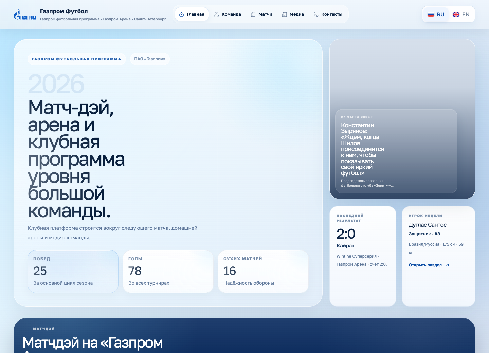
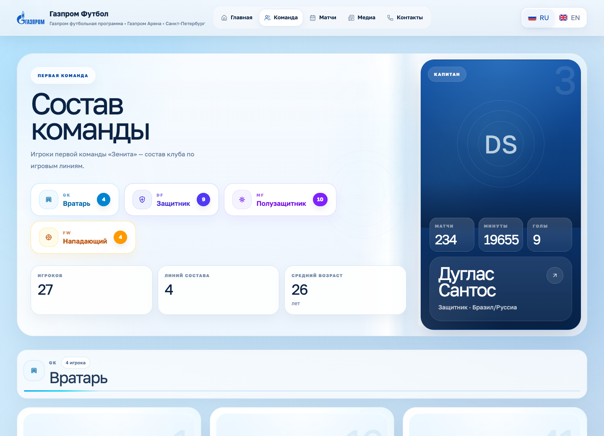
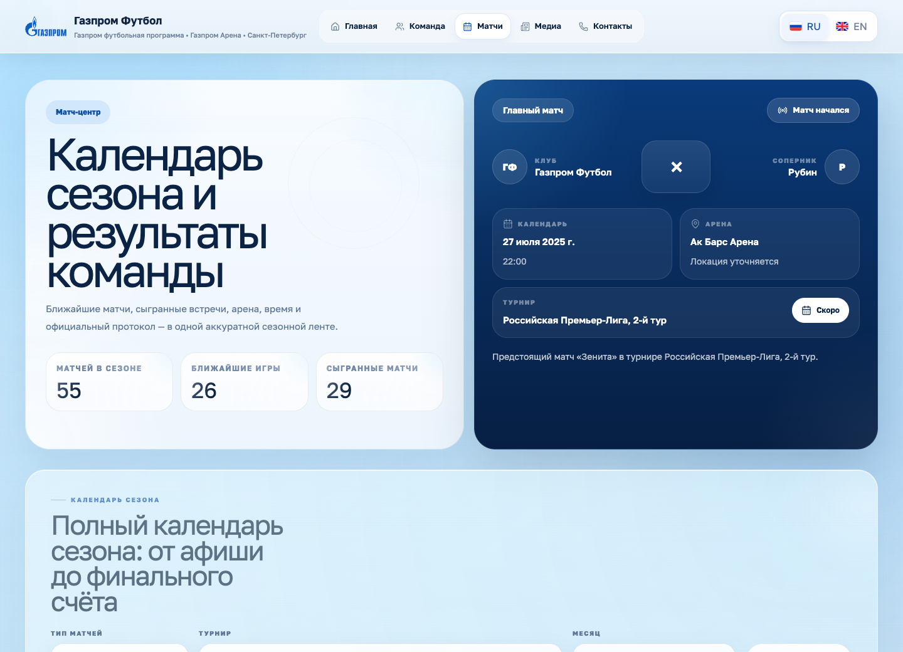
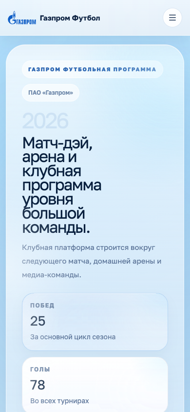

# Gazprom Football Club Website

Публичный сайт футбольного клуба с Django-бэкендом, React/Vite-интерфейсом, админкой, JSON API, фоновой синхронизацией матч-хаба и демо-данными для быстрого запуска.

Проект собран как витрина клуба: главная страница, состав, профиль игрока, календарь матчей, медиа-раздел, контакты, RU/EN локализация и адаптивный интерфейс.



## Скриншоты

| Состав | Матчи |
| --- | --- |
|  |  |

| Мобильная версия |
| --- |
|  |

## Стек

- Backend: Django 5, Django Admin, Django JSON API
- Frontend: React 18, Vite, React Router, Tailwind CSS 4
- 3D/визуализация: Three.js, React Three Fiber
- Очереди и кэш: Celery, Redis, Django cache
- База данных: PostgreSQL в Docker, SQLite для локального запуска без Docker
- Static delivery: WhiteNoise, собранный Vite bundle в `static/dist`
- Runtime: Docker Compose, Gunicorn, Nginx

## Возможности

- Серверные публичные страницы с `initial_payload` для быстрой загрузки.
- SPA-навигация поверх React Router без отдельного frontend-сервиса.
- RU/EN локализация интерфейса и контента.
- Админка для клуба, игроков, матчей, новостей, трофеев и галереи.
- API endpoints для всех публичных разделов.
- Кэширование публичных payloads и матч-хаба через Redis.
- Безопасная деградация кэша: если Redis недоступен, сайт продолжает работать.
- Reference snapshot с демо-составом, календарем, новостями и медиа.
- Docker-стек с PostgreSQL, Redis, Celery, Celery Beat, Web и Nginx.

## Архитектура

```text
Django
  config/              настройки, URL, WSGI/ASGI, Celery
  club/                модели, payload builders, API, admin, tasks
  templates/           HTML shell и server fallback
  static/dist/         собранный React/Vite bundle

React
  webapp/src/app       роутинг приложения
  webapp/src/pages     публичные страницы
  webapp/src/widgets   layout, header, footer, 3D сцены
  webapp/src/shared    UI kit, i18n, helpers

Data
  data/reference_snapshot.json
```

Поток данных:

1. Django собирает payload через `club/payloads.py`.
2. HTML-страница получает `initial_payload` через `json_script`.
3. React гидратируется в `#react-app-root`.
4. При клиентской навигации данные догружаются из `/api/*` и кэшируются в памяти вкладки.
5. Серверные payloads кэшируются через Django cache/Redis и инвалидируются при изменении контента.

## Быстрый запуск через Docker

```bash
cp .env.example .env
docker compose up --build -d
```

После запуска:

- Сайт: http://127.0.0.1:8000/
- Админка: http://127.0.0.1:8000/admin/
- API главной: http://127.0.0.1:8000/api/home/

Демо-админ из `.env.example`:

```text
login: admin
password: admin123
```

## Локальный запуск без Docker

Подходит для быстрого просмотра Django-части. В этом режиме используется SQLite.

```bash
python3 -m venv .venv
source .venv/bin/activate
pip install -r requirements.txt

python manage.py migrate
python manage.py sync_reference_snapshot
python manage.py runserver 127.0.0.1:8000
```

Если нужен свежий frontend bundle, потребуется Node.js и npm:

```bash
npm install --prefix webapp
npm run build --prefix webapp
```

## API

| Endpoint | Назначение |
| --- | --- |
| `/api/site/` | Базовый профиль клуба для общего chrome |
| `/api/home/` | Главная страница: hero, матчи, новости, игроки, галерея |
| `/api/team/` | Состав, капитан, группы по позициям |
| `/api/matches/` | Календарь, главный матч, матч-хаб |
| `/api/media/` | Новости и галерея |
| `/api/contacts/` | Контакты, каналы, последние матчи |

## Кэширование

На сервере используются два уровня:

- `club:match_hub` - ближайшие и последние матчи, обновляется Celery Beat каждые 10 минут и хранится 15 минут.
- `club:public_payload:*` - payloads публичных страниц, хранятся 5 минут.

Инвалидация публичного кэша выполняется при сохранении или удалении:

- профиля клуба;
- игрока;
- матча;
- новости;
- медиа-элемента;
- трофея;
- reference snapshot.

Кэш работает через Redis в Docker. Если Redis временно недоступен, проект не падает: payload считается напрямую из базы.

## Демо-данные

Reference snapshot находится в:

```text
data/reference_snapshot.json
```

Импорт:

```bash
python manage.py sync_reference_snapshot
```

В Docker:

```bash
docker compose exec -T web python manage.py sync_reference_snapshot
```

## Полезные команды

```bash
docker compose up -d
docker compose logs -f web
docker compose logs -f celery
docker compose logs -f celery-beat
docker compose exec -T web python manage.py createsuperuser
docker compose exec -T web python manage.py seed_demo
docker compose down
```

Проверки:

```bash
python manage.py check
python manage.py test
```

## Структура проекта

```text
.
├── club/                  Django app: models, views, API, admin, cache, tasks
├── config/                Django settings, URLs, Celery, WSGI/ASGI
├── data/                  Reference snapshot
├── docs/                  Документация и скриншоты
├── infra/nginx/           Nginx image and config
├── static/dist/           Production frontend bundle
├── templates/             Django templates
├── webapp/                React/Vite source
├── docker-compose.yml     Полный локальный стек
├── Dockerfile             Web/Celery image
└── requirements.txt       Python dependencies
```
